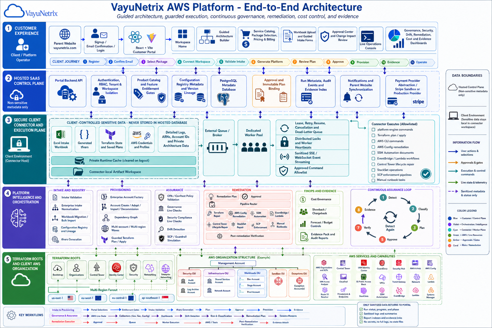
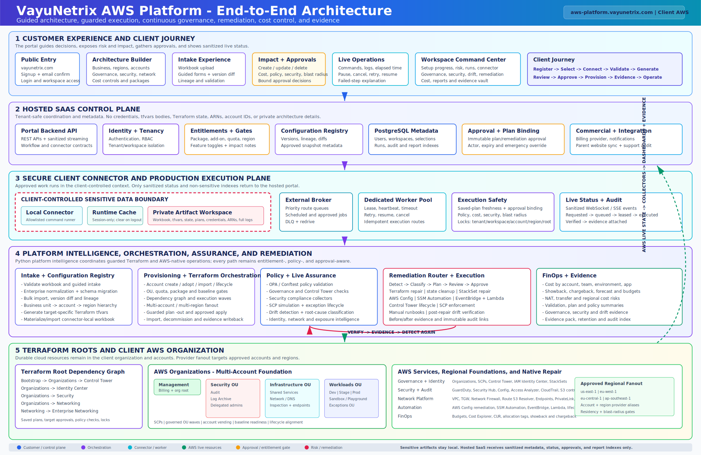

# VayuNetrix Platform Public Docs

VayuNetrix is a product family for guided cloud and AI platform engineering. It is being built around a simple idea: customers should be able to choose the platform capability they need, understand the price and scope, approve changes before anything risky happens, and receive clear evidence of what was done.

This public repository explains the business model, architecture, customer journey, security boundary, deployment model, and public roadmap. It intentionally does not contain product source code, Terraform, Python automation, credentials, generated artifacts, or customer-sensitive details.

## Live Product Surfaces

| Surface | Purpose | URL / Repository |
| --- | --- | --- |
| VayuNetrix parent website | Public website, registration, email confirmation, product selection, pricing/quote flow, customer command center, support entry point, and product launch routing | [www.vayunetrix.com](https://www.vayunetrix.com) |
| AWS Platform portal | Product-specific AWS platform workspace after a signed handoff from the parent website | [aws-platform.vayunetrix.com](https://aws-platform.vayunetrix.com) |
| AWS Platform API | Product API for portal health, handoff, workspace metadata, entitlement-aware views, and guarded operations | [api.aws-platform.vayunetrix.com](https://api.aws-platform.vayunetrix.com) |
| Public docs repo | Business and technical overview documentation | [gprai/vayunetrix-platform-docs](https://github.com/gprai/vayunetrix-platform-docs) |
| Parent website repo | Parent website and product hub implementation | [gprai/vayunetrix](https://github.com/gprai/vayunetrix) |
| AWS Platform implementation repo | Private product implementation for AWS Platform portal, platform engine, Terraform, connector, workers, policies, and guarded execution | [gprai/aws-platform-engineering](https://github.com/gprai/aws-platform-engineering) |
| GateForge project | Next VayuNetrix product under development for approved infrastructure template delivery and audit evidence | [gprai/GateForge](https://github.com/gprai/GateForge) |

## What The AWS Platform Product Includes

VayuNetrix AWS Platform is a guided AWS platform engineering product. In plain language, it helps a customer answer:

- Which AWS accounts, regions, and environments do we need?
- Which governance, security, networking, remediation, and cost controls should be enabled?
- What will change before we approve it?
- Who approved it?
- Did the change succeed?
- Can we prove it later with evidence?

The product combines a parent website, a product portal, a backend API, metadata storage, workflow execution, a secure connector model, Terraform orchestration, policy checks, live AWS assessments, remediation planning, cost governance, and evidence reporting.

## Business Flow

```text
Customer visits www.vayunetrix.com
-> registers and confirms email
-> chooses AWS Platform Engineering
-> selects package and capabilities
-> receives quote/order/subscription status
-> launches AWS Platform through signed handoff
-> lands in AWS Platform Workspace Home
-> connects local/client workspace when execution is needed
-> validates intake and reviews impact
-> approves guarded actions
-> watches live operation status
-> receives governance, security, drift, remediation, cost, and evidence summaries
```

The parent website owns commercial entry: registration, customer identity, product selection, quote/order/subscription status, and support entry. The AWS Platform portal owns product execution: workspace home, entitlement-aware product views, intake, approval-aware operations, evidence summaries, and AWS-platform-specific workflows.

## Architecture



Customer workflow view:



## Technology Flavor

The private implementation uses a modern cloud/SaaS stack. Public-safe highlights include:

- Parent website: Next.js / React frontend with backend API services.
- AWS Platform portal: React/Vite customer portal.
- Backend APIs: Python/FastAPI-style services.
- Data store: PostgreSQL metadata database with product schemas.
- Infrastructure: AWS, ECS/Fargate, ALB, CloudFront/S3, RDS PostgreSQL, SQS, Secrets Manager, SES, CloudWatch, WAF, Route 53/ACM, and Terraform.
- Platform engine: Python CLI workflows for intake validation, tfvars generation, policy validation, governance, security, drift, remediation, cost, and evidence.
- Policy and guardrails: OPA/Conftest-style checks and approval gates.
- Execution model: hosted metadata plane plus customer-controlled connector/runtime boundary.

## Public Documentation

- [Business overview](docs/platform/business-overview.md)
- [Product architecture](docs/platform/product-architecture.md)
- [Customer journey](docs/platform/customer-journey.md)
- [Service packages](docs/platform/service-packages.md)
- [Security and trust model](docs/security/security-and-trust-model.md)
- [Connector data boundary](docs/security/connector-data-boundary.md)
- [High-level deployment model](docs/platform/high-level-deployment-model.md)
- [Public roadmap](docs/roadmap/public-roadmap.md)
- [FAQ](docs/platform/faq.md)
- [Parent website content](docs/website/parent-website-content.md)
- [Public onboarding guide](docs/onboarding/public-onboarding-guide.md)

## Repository Boundary

This public repository does not contain:

- Terraform implementation code
- Python platform engine code
- portal API or frontend source code
- connector source code
- policy source code
- generated tfvars
- Terraform state
- live AWS reports
- customer account IDs, ARNs, credentials, emails, or private architecture details

## Product Status

The AWS Platform product is in beta/productization. The parent website and AWS Platform portal have been deployed for testing with signed product handoff, entitlement-aware portal access, hosted AWS infrastructure, PostgreSQL metadata storage, SES email capability, and ongoing security/cost hardening.

GateForge is the next VayuNetrix product under development. It focuses on approved infrastructure templates, Terraform plan review, policy checks, named approval, controlled apply, and audit evidence for regulated engineering teams.
